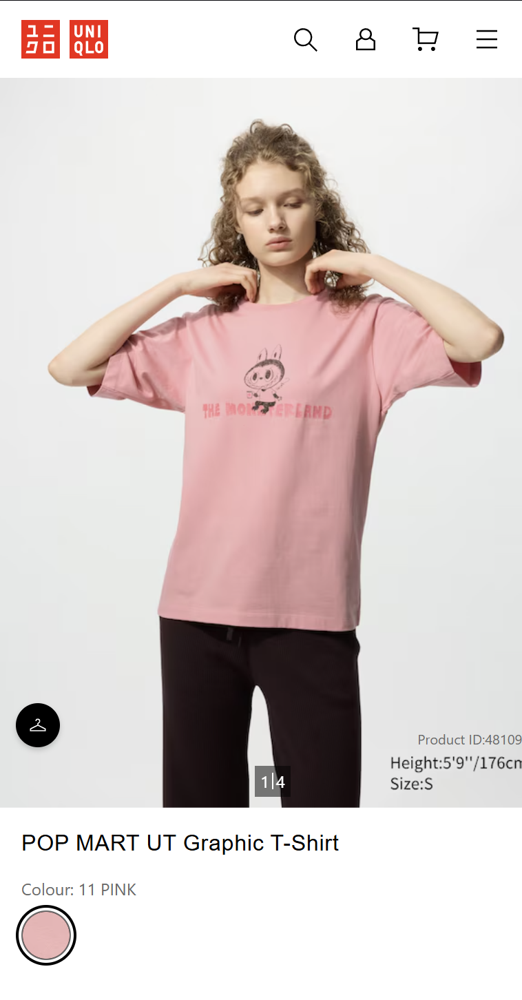

# Procesverslag
Markdown is een simpele manier om HTML te schrijven.  
Markdown cheat cheet: [Hulp bij het schrijven van Markdown](https://github.com/adam-p/markdown-here/wiki/Markdown-Cheatsheet).

Nb. De standaardstructuur en de spartaanse opmaak van de README.md zijn helemaal prima. Het gaat om de inhoud van je procesverslag. Besteedt de tijd voor pracht en praal aan je website.

Nb. Door *open* toe te voegen aan een *details* element kun je deze standaard open zetten. Fijn om dat steeds voor de relevante stuk(ken) te doen.

## Jij

  
uitwerken voor kick-off werkgroep

  ### Auteur:
  Lam Nguyen

  #### Je startniveau:
  blauw/rood (meer blauw denk ik)

  #### Je focus:
  Responsive
 

## Je website

  
uitwerken voor kick-off werkgroep

  ### Je opdracht:
  https://www.uniqlo.com/nl/en/spl/ut/pop-mart-labubu
  https://www.uniqlo.com/nl/en/products/E481097-000/00?colorDisplayCode=11&sizeDisplayCode=003  
  #### Screenshot(s) van de eerste pagina (small screen): 
  hier de naam van de pagina  
  
  
  
  
  #### Screenshot(s) van de tweede pagina (small screen):
  hier de naam van de pagina  
  
  
  

## Toegankelijkheidstest 1/2 (week 1)

  
uitwerken na test in 2e werkgroep

  ### Bevindingen
  Lijst met je bevindingen die in de test naar voren kwamen:
  - Geen H1?
  - Headings heten bijna allemaal hetzelfde voor de producten
  - Geen gedetailleerde alt teksten voor images
  - Heading namen van producten zijn de volledige beschrijving
  - Volgorde van screenreader navigeren met tab is verwarrend
  - screenreader springt tussen heading levels

  - w3c validator: 6 errors, 6 warnings, 4 info messages

  - Gebruikt alleen maar divs met classes en id
  - images hebben alt tekst maar geen goede beschrijving, elk tshirt heeft als alt tekst tshirt
  - alt tekst van de promotie foto is wel goed
  - geen dark mode

  - contrast is AAA, alles is zwart op wit

## Breakdownschets (week 1)

  
uitwerken na afloop 3e werkgroep

  ### de hele pagina: 
  
  

  ### dynamisch deel (bijv menu): 
  

  ### wellicht nog een dynamisch deel (bijv filter): 
  

## Voortgang 1 (week 2)

  
uitwerken voor 1e voortgang

  ### Stand van zaken
  - eerste HTML was af

  ### Agenda voor meeting
  - niet echt vragen tot nu toe
  - juist gebruik van sections en andere elementen?

  ### Verslag van meeting
  - aria-labels en alt teksten voor images nog toevoegen
  - verder nog niet echt punten omdat er ook nog niet veel is naast html.

## Voortgang 2 (week 3)

  
uitwerken voor 2e voortgang

  ### Stand van zaken
  - 1e pagina ongeveer af
  - kortingen nog toevoegen
  - 2e pagina beginnen

  ### Agenda voor meeting
  - volgorde van elementen in html
  - hoe select ik de discounted p?
  - mag section voor onderste links?
  - images in grid niet op een lijn T_T

  ### Verslag van meeting
  - volgorde aanpassen fixt ook het select probleem
  - section mag
  - Sanne heeft het grid gefixt YAY!

## Toegankelijkheidstest 2/2 (week 4)

  
uitwerken na test in 9e werkgroep

  ### Bevindingen
  - focus stijl veranderd voor betere zichtbaarheid
  - alle images uitgebreidere alt teksten gegeven
  - aria labels bij knoppen
  - current page toegevoegd
  - scroll knoppen toegevoegd

## Voortgang 3 (week 4)

  
uitwerken voor 3e voortgang

  ### Stand van zaken
  - 1e pagina zo goed als af
  - 2e pagina alleen image carousel af tot nu toe

  ### Agenda voor meeting
  - details?
  - add to cart stukje hoe?

  ### Verslag van meeting
  - uitleg over details gekregen, animatie een maybe maar dat moet via die powel guy op youtube
  - form gebruiken voor die add to cart en dan met section sticky op groot scherm

## Eindgesprek (week 5)

  
uitwerken voor eindgesprek

  ### Dit ging goed/Heb ik geleerd: 
  semantisch coderen is voor mijn gevoel veel beter gegaan deze keer. grid en flexbox snap ik nu ook eindelijk grotendeels. de detailpagina ben ik eigenlijk ook best trots op ook al vind ik het uiterlijk wat minder. De form was nog best lastig en iets wat ik nog nooit eerder had gedaan. De people also viewed carousel duurde ook veel langer dan ik dacht, maar is wel goed gelukt. 

  ### Dit was lastig/Is niet gelukt:
  De eerste keren de html neerzetten voordat ik aan de css begon ging steeds compleet fout. ik snapte te weinig van hoe ik het ging opmaken met grid bijv, dus ik moest halverwege toch weer alles aanpassen steeds. screenreader besturen gaat ook dramatisch, mijn laptop weigerd mee te werken. Bijhouden van de readme was ook heel lastig dat vergat ik steeds en het op tijd inleveren is ook niet helemaal gelukt.

## Bronnenlijst

  
continu bijhouden terwijl je werkt

  - https://www.youtube.com/watch?v=gmI5nvzv170 (image carousel)
  - https://www.youtube.com/watch?v=5OrlF71bFrk (radio button stylen)

